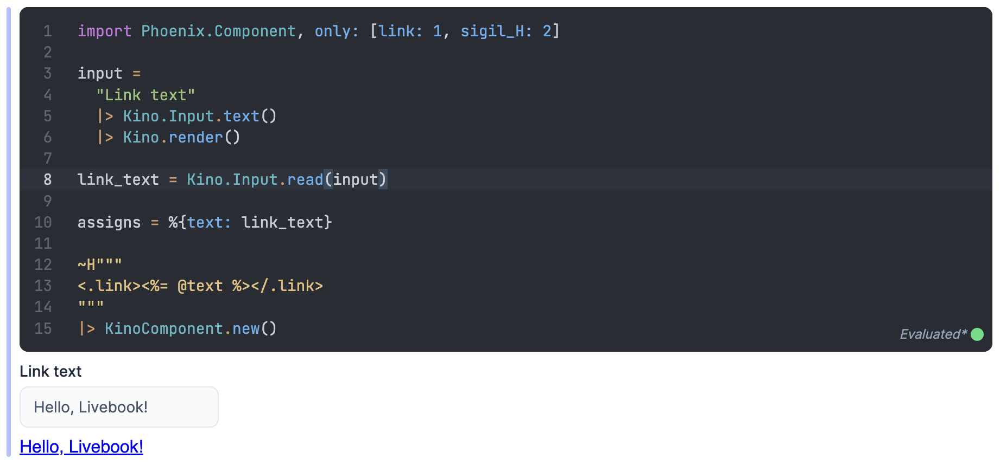

# KinoComponent

Render Phoenix function components in Livebook.

## Installation

To bring KinoComponent to Livebook all you need to do is `Mix.install/2`:

```elixir
Mix.install([
  {:kino_component, "~> 0.2"},
  {:phoenix_live_view, "~> 1.0"}
])
```

## Examples

After installing this package in Livebook you can interactively experiment with
Phoenix function components:


